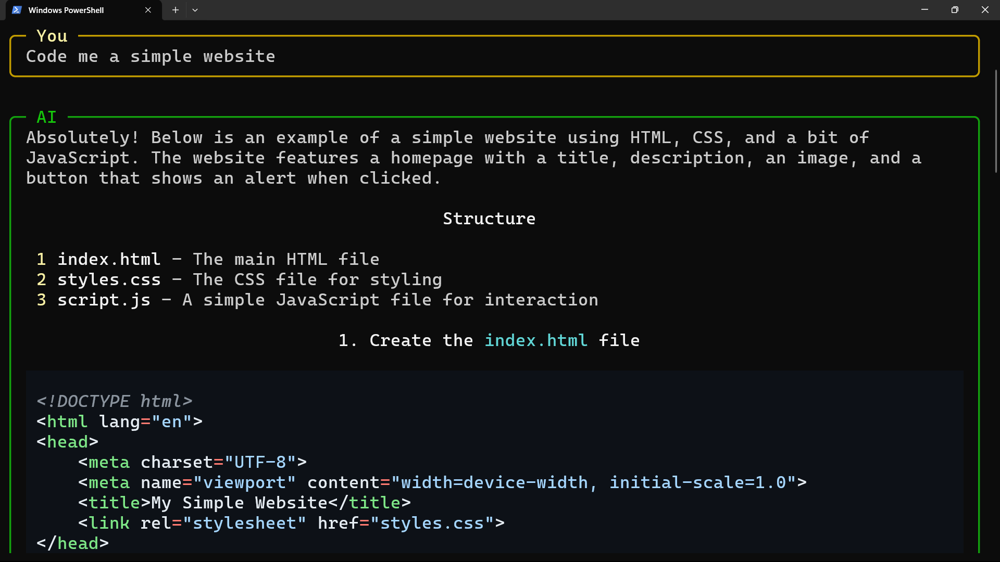

# Pretty Bot

Pretty Bot is a simple command-line chat application that uses OpenAI's GPT models to generate responses. It features a user-friendly interface with color-coded messages and markdown support.



## Prerequisites

- Python 3.6 or higher
- OpenAI API key

## Installation

1. Clone this repository:
   ```
   git clone https://github.com/yourusername/pretty-bot.git
   cd pretty-bot
   ```

2. Set up a virtual environment:
   ```
   python -m venv venv
   ```

3. Activate the virtual environment:
   - On Windows:
     ```
     venv\Scripts\activate
     ```
   - On macOS and Linux:
     ```
     source venv/bin/activate
     ```

4. Install the required packages:
   ```
   pip install -r requirements.txt
   ```

5. Create a `.env` file in the root folder and add your OpenAI API key:
   ```
   OPENAI_API_KEY=your_api_key_here
   ```

## Usage

To start the Pretty Bot application, run:

```
python main.py
```

- Type your message and press Enter to chat with the AI.
- Type `/exit` and press Enter to close the application.

A more detailed walkthrough of the source code is available in docs.md

## Files

- `main.py`: The main application file that handles user input and AI responses.
- `call_ai.py`: Contains the function to call the OpenAI API.
- `utils.py`: Utility functions for handling user input and terminal operations.
- `requirements.txt`: List of Python package dependencies.

## License

This project is licensed under the MIT License. See the [LICENSE](LICENSE) file for details.

## Contributing

Contributions are welcome! Please feel free to submit a Pull Request.

## Acknowledgements

- [OpenAI](https://openai.com/) for providing the GPT models.
- [Rich](https://github.com/Textualize/rich) for the beautiful terminal formatting.